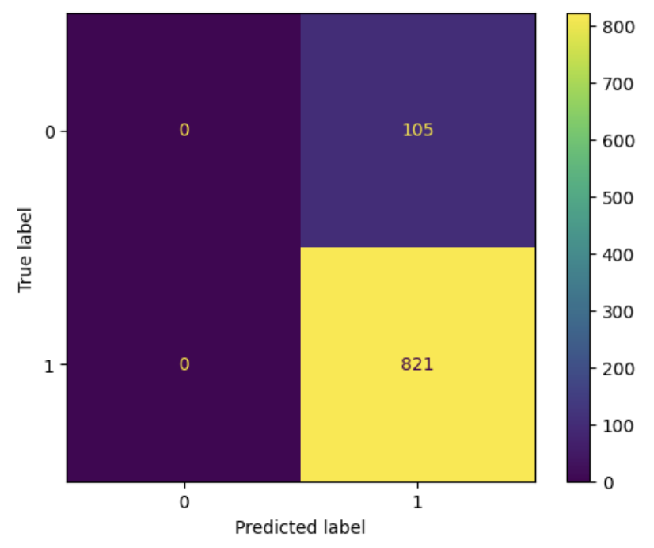

# Rocket Launch Success Prediction Using Logistic Regression

## Introduction
In this project, we aim to predict the success of rocket launches based on features such as launch year, rocket status, and other variables. The dataset used for this analysis is from the Kaggle Space Missions dataset, and we applied Logistic Regression to model the binary classification of mission success.

## Problem Statement
The primary goal of this project is to build a model that accurately predicts whether a rocket launch will be successful (`MissionSuccess`), given certain features. Our analysis focuses on optimizing a Logistic Regression model to classify successful and failed rocket launches, using techniques such as hyperparameter tuning, threshold adjustments, and misclassification analysis.

## Steps Involved in the Project:
1. Data Cleaning and Preparation
2. Model Training using Logistic Regression
3. Hyperparameter Tuning using Grid Search
4. Threshold Adjustment and Misclassification Analysis
5. Model Evaluation and Conclusion

---

## Data Preprocessing

Before modeling, we cleaned the data and prepared it for Logistic Regression:

1. **Scaling the Features**: We used `StandardScaler` to normalize the features to improve the performance of the Logistic Regression model.
2. **Feature Selection**: We selected key features such as `LaunchYear` and `RocketStatus` to be used in the model.

## Correlation Matrix

We computed the correlation matrix to understand the relationships between different features and the target (`MissionSuccess`).

```python
# Code to generate correlation matrix
correlation_matrix = df.corr()
sns.heatmap(correlation_matrix, annot=True, cmap='coolwarm')
```


### Correlation Matrix Heatmap:


From the heatmap, we can observe that the `LaunchYear` has a weak correlation with `MissionSuccess`, and there is little correlation between `RocketStatusCode` and the target.

---

## Logistic Regression Model Training

We used Logistic Regression for the initial model and applied **GridSearchCV** to find the optimal hyperparameters. The best parameters were:
- `C = 0.01`
- `penalty = 'l1'`
- `solver = 'liblinear'`
- `max_iter = 200`

### Feature Importance:
After fitting the model, we plotted the feature importance to identify which features had the most impact on predicting mission success.

```python
# Plot feature importance for Logistic Regression
coefficients = pd.DataFrame({'Feature': X.columns, 'Coefficient': best_model.coef_[0]})
coefficients.sort_values(by='Coefficient', ascending=False).plot(kind='barh', x='Feature', y='Coefficient')
```

---

## Mission Success Rate Over Years

```python
# Plotting the mission success rate over years
success_by_year = df.groupby('LaunchYear')['MissionSuccess'].mean()
success_by_year.plot(kind='line', title='Mission Success Rate Over Years')
```

### Mission Success Rate Over Years:
The mission success rate increased significantly over the decades, indicating improved reliability in rocket launches as technology advanced.

## Threshold Adjustment and Misclassification Analysis

### Threshold Adjustment

We initially used the default threshold of 0.5 to classify mission success. To improve precision, we adjusted the threshold to 0.6 and 0.7. This allowed us to reduce the number of false positives while balancing recall.

```python
# Adjust threshold and evaluate precision and recall
threshold = 0.6  # Experiment with different thresholds
y_pred_adjusted = (best_model.predict_proba(X_test_scaled)[:, 1] >= threshold).astype(int)
```

### Confusion Matrix After Threshold Adjustment:

After adjusting the threshold, we analyzed the confusion matrix to evaluate the model’s performance.

```python
# Plot confusion matrix for adjusted threshold
ConfusionMatrixDisplay.from_predictions(y_test, y_pred_adjusted)
```

### Confusion Matrix:

This matrix shows that the model captured all successful missions (recall = 1.0) but struggled with false positives, predicting a few failed missions as successful.

## Model Evaluation: ROC Curve

Finally, we plotted the ROC curve to evaluate the trade-offs between true positive rate and false positive rate at different threshold levels.

```python
# Plotting the ROC curve
fpr, tpr, _ = roc_curve(y_test, model.predict_proba(X_test_scaled)[:,1])
plt.plot(fpr, tpr)
plt.xlabel('False Positive Rate')
plt.ylabel('True Positive Rate')
plt.title('ROC Curve')
```


### ROC Curve:

The ROC curve gives a visual representation of the model’s performance across different thresholds. The model has decent performance with an acceptable true positive rate.

## Rocket Status Analysis
We also examined the impact of RocketStatus on mission success:

```python
# Plotting mission success based on rocket status
sns.countplot(x='RocketStatus', hue='MissionSuccess', data=df)
```

### Rocket Status Analysis:
From this plot, it is evident that both Active and Retired rockets had high mission success rates, though there are more Retired rockets in the dataset.

## Conclusion

	•	Model Performance: Logistic Regression achieved a high recall score (1.0), meaning it successfully identified all successful launches. However, it had some issues with false positives, which we addressed through threshold adjustment.
	•	Next Steps: Given the performance of the Logistic Regression model, we may want to try more complex models such as Random Forest or Gradient Boosting to see if we can further improve precision and overall accuracy without the need for heavy threshold tuning.

Feel free to clone this repository and explore the dataset further. Contributions are welcome!


## References:
	1.	Space Missions Dataset from Kaggle.
	2.	Scikit-learn documentation for Logistic Regression.


